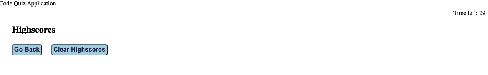

# Code Quiz - Web APIs Project

## Link
### Please click [here](https://qd9069.github.io/code_quiz_api_project/) to find the deployed project.


## Table of Contents

- [Link](#link)
- [Description](#description)
- [Usage](#usage)
- [Features](#features)
- [Technology](#technology)
- [Assets](#assets)
- [License](#license)

## Description

Welcome to the Code Quiz application page!

This is a fun quiz for anyone who likes coding. There are total of five questions in the quiz and you will need to complete all the questions before the timer reaches 0. Everytime when you pick a wrong answer for the question, time will be subtracted from your clock. After the quiz, please enter your initial so we can save your score. You can also view the Highscores list at the end of the quiz to compare with your peers.

The main purpose of this project is to practise my skills for Web APIs in JavaScript, including the uses of for loop, set/clear time interval, event listener, local storage, function for timer to count down, etc.

Hope we all enjoy this code quiz! 


## Usage

Below is a basic instruction for the Code Quiz Application:
- Read the brief introduction to the quiz before starting it
- Click on "Start" button to start the quiz
    - A timer starts and you will be presented with a question
- Click on the choices to answer questions:
    - If you answer the question correctly, you will see the next question
    - Everytime when you answer the question incorrectly, time will be subtracted from the clock
- The quiz will be ended when all questions are answered or the timer reaches 0
- After the quiz is ended, please enter your initial to save the score
    - Your score will be the reminaing time in the clock when the quiz is ended
- You can view the HighScores list at the end of the quiz
    - Click on the "Go Back" button, you can go back to the first page and restart the quiz
    - Click on the "Clear Highscores" button, the stored scores will be cleared


## Features

Here are some highlighted features in this Code Quiz Application:
- A count down timer starts when click on the "Start" button
- A pop-ups window will be displayed if you answer the question incorrectly
- Time will be subtracted from the timer if you answer the question incorrectly
- Alert message will be displayed if you did not enter your initial
- The Highscores list can show you your peers' score
- The Highscores list is sorted from the highest score to the lowest score
- The "Clear Highscores" button allows you to clear all the stored scores previously


## Technology

 ```md
- JavaScript
- HTML
- CSS
```

## Assets

The following images demonstrate the web application's appearance and functionality:

The start page:


The question page:


If wrong answer is selected:


The page to enter intial:


The Highscores page:


After clear Highscores:


## License

Copyright (c) 2022 Elaine D. Released under the MIT [License](./LICENSE).
---
Code originally by QD 2022 🏆

